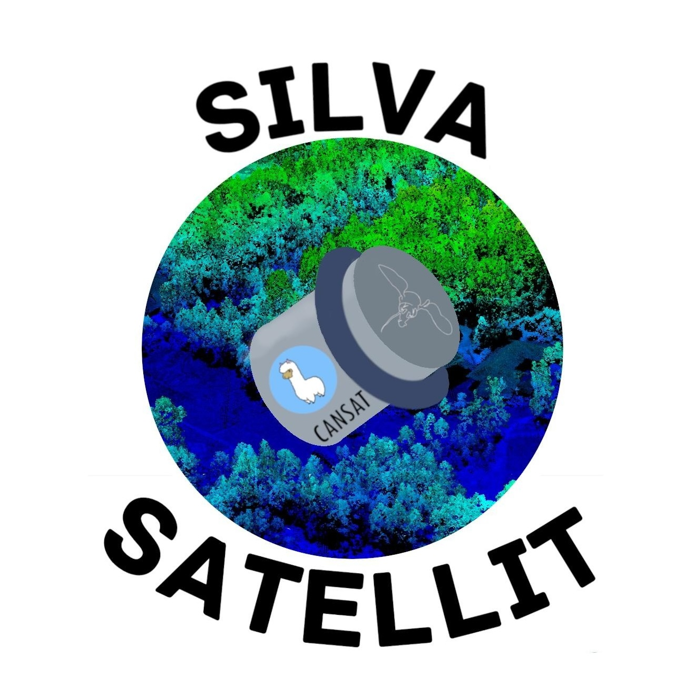

# SilvaSatellit

## Wer sind wir?

### Das Team

Wir sind alle Teilnehmer am [Heidelberger Life-Science Lab](https://www.life-science-lab.org/cms). Dort nehmen wir mit dem CanSat-AGüP am 10. [deutschen CanSat Wettbewerb](https://www.cansat.de) teil. Wir sind aufgeteilt in ein Kernteam, bestehend aus 8 Teilnehmern und ein Unterstützungsteam.

### Sekundärmission

Mit unserer Sekundärmission wollen wir die Wahrscheinlichkeit von Waldbränden vorhersagen, damit präventiv Maßnahmen getroffen werden können. Dies wollen wir mit einer in den CanSat eingebauten Wärmebildkamera erreichen.

## Sponsoren

> Aktuell sind wir noch auf der Suche nach Sponsoren